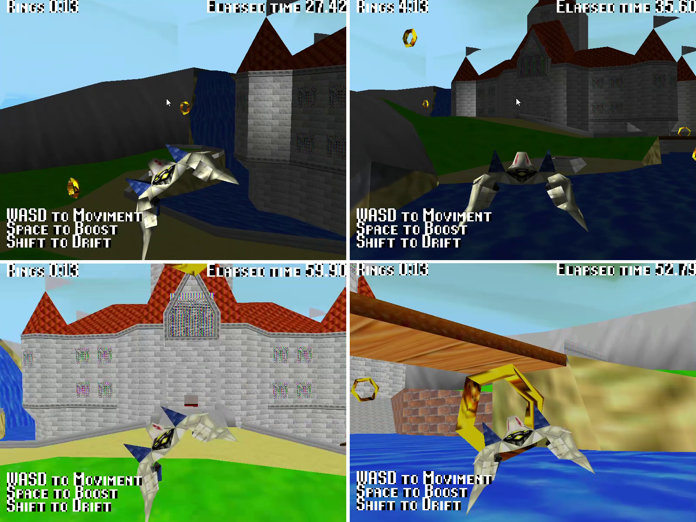

# CearaFox

<div align="center">
  
</div>
CearaFox é um jogo 3D desenvolvido usando Python e OpenGL. O jogo apresenta vários modelos, shaders e um sistema de câmera para proporcionar uma experiência divertida. Este README fornece uma visão geral da estrutura do projeto, instruções de instalação, objetivos do jogo e mais.

Este é um projeto desenvolvido para ser o pojeto valendo a nota da ultima avaliação da cadeira de computação gráfica de 2024.1 da graduação de engenharia da computação na universidade federal UNILAB. Foram usados todos os conceitos aprendidos durante a cadeira durante todo o semestre e além para desenvolver este projeto.

Pessoalmente foi um otima experiência ter desenvolvido este joguinho apesar do pouco tempo disponivel para desenvolve-lo, praticamente uma GAME JAM. Foi minha primeira experiência desenvolvendo um jogo que não fosse CLI no terminal.

## Índice

- Instalação
  - Linux
  - Windows
- Como Jogar
- Objetivo do Jogo
- Modos
  - Modo Desenvolvedor
  - Modo de Luz Difusa
- Licença

## Instalação

### Linux

1. Instale Python e pip:
   ```bash
   sudo apt update
   sudo apt install python3 python3-pip
   ```
2. Crie um ambiente virtual:
   ```bash
   python3 -m venv venv
   source venv/bin/activate
   ```
3. Instale as dependências:
   ```bash
   pip install -r requirements.txt
   ```

### Windows

1. Instale Python e pip: Baixe e instale Python de [python.org](https://www.python.org/downloads/).
2. Adicione Python ao PATH durante a instalação.
3. Crie um ambiente virtual:
   ```bash
   python -m venv venv
   .\venv\Scripts\activate
   ```
4. Instale as dependências:
   ```bash
   pip install -r requirements.txt
   ```

## Como Jogar

1. Execute o jogo:
   ```bash
   python main.py
   ```
2. Controles:
   - So é possivel usar o **teclado para mover** a câmera e interagir com o jogo.
   - Use as teclas '**WASD**' para se movimentar
   - **Shift direito** para ir para os lados mais rapido
   - **Tecla de espaço** para ir mais rapido

## Objetivo do Jogo

O objetivo do jogo é navegar pelo ambiente, coletar anéis de ouro e evitar obstáculos no tempo limite estipulado. O jogo apresenta vários modelos e cenários para melhorar a experiência de jogo.

## Modos

### Modo Desenvolvedor

O Modo Desenvolvedor permite que você mova livremente a câmera e explore o ambiente do jogo sem restrições. Este modo é útil para testes e depuração.

Para habilitar o Modo Desenvolvedor, defina `DEV_MODE` como `True` em `configs.py`.

No modo desenvolvedor é possivel usar **mouse para olhar em volta** e as teclas "WASD" para se movimentar, use o **shift direito** para descer rapidamente e a **tecla de espaço** para se mover para cima rapidamente.

### Modo de Luz Difusa

O Modo de Luz Difusa altera a iluminação do jogo para um estilo mais difuso, proporcionando uma experiência visual diferente.

Para habilitar o Modo de Luz Difusa, defina `DIFUSE_LIGHT_MODE` como `True` em `configs.py`.

## Licença

Este projeto está licenciado sob a Licença MIT. Veja o arquivo LICENSE para mais detalhes.
